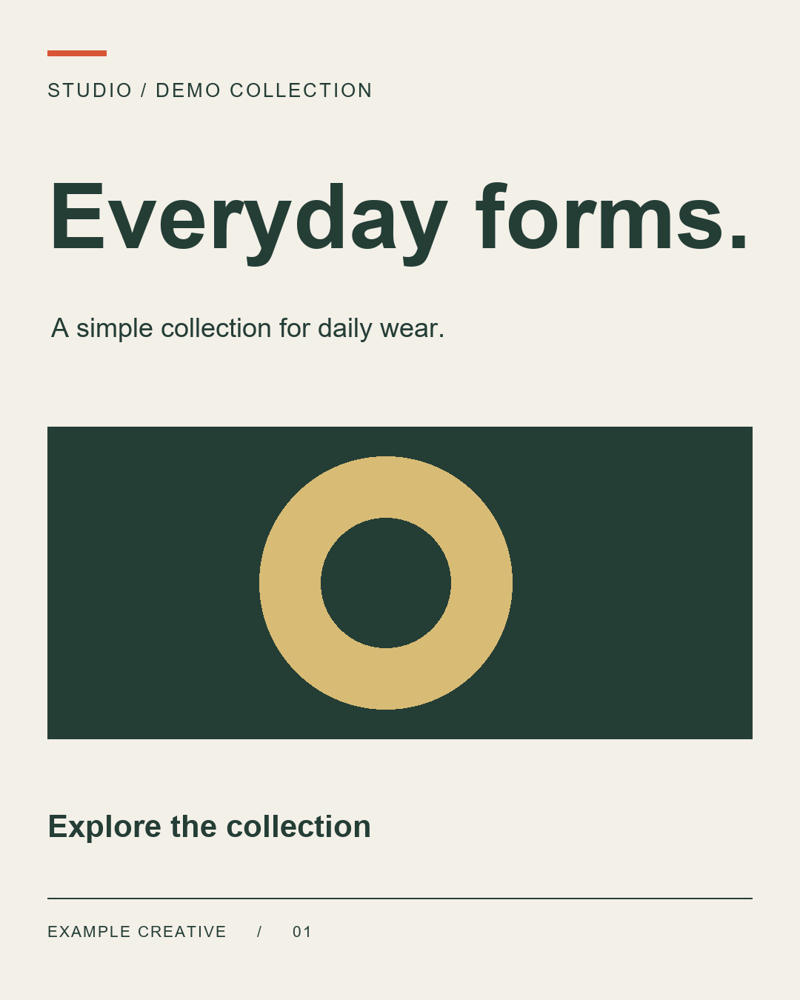

# Programmatic Creative Pipeline

By Andi Dazai.

Turn a local JSON layout and CSV copy into a set of creative assets. Text sizes
are resolved once, then shared by the PNG and editable PowerPoint exporters.

Reconstructed from a small Pillow text-fitting snippet. This is a new implementation,
not a recovery of the original file. No API keys, network services, or paid assets.



## Quick start

Requires Python 3.10+ and an installed TrueType/OpenType font.

```sh
python -m venv .venv
```

Activate with `.venv\Scripts\Activate.ps1` in PowerShell or
`source .venv/bin/activate` on macOS/Linux. Then:

```sh
python -m pip install -r requirements.txt
python render_set.py examples/campaign.json --data examples/campaign.csv --out output --pptx
python -m unittest -v
```

Each CSV row produces `<id>.png` and `<id>.json`. `--pptx` adds one
`creatives.pptx` with one slide per row. Without a CSV, a template with literal
text produces `creative.png` and `creative.json`. Omit `--pptx` for PNG/JSON only.

The output directory must be new. To rerun, choose `--out output-v2`.
The whole batch is staged before publishing its output directory, so a failed
creative leaves no partial set and existing output is preserved.

## Make it yours

1. Copy the example template and CSV into your campaign folder.
2. Edit the canvas dimensions, colors, positions, and typography in JSON.
3. Edit the copy in CSV. Keep a unique `id` for every row.
4. Run the command with your files and a new output directory.

Use `$headline` or `${headline}` in text to insert a CSV column.
Use `$$` for a literal dollar sign. Substitution values are literal text;
they are never evaluated as code. Missing columns fail with an error.

All measurements, including font size and tracking, are in pixels. Elements
draw in list order, from back to front. The canvas supports integer dimensions
up to 8192 pixels per side and 32 megapixels total.

Every element has `kind`, `x`, `y`, `width`, and `height`.

| Kind | Additional fields | Behavior |
| --- | --- | --- |
| `text` | `text`, `font`, `size`, `min_size`, `color`, `tracking`, `align` | A single line fitted to its safe box |
| `rect` | `color` | Solid rectangle |
| `ellipse` | `color` | Solid ellipse |
| `image` | `src` | Local picture, centered and cropped to fill its box |

Text defaults: `font: "auto"`, `size: 64`, `min_size: 10`, `color: "black"`,
`tracking: 0`, `align: "center"`. Supported alignments are `left`, `center`,
and `right`. `y` is the top of the visible glyphs in the PNG. Use a separate
element for each line. An empty string intentionally draws no text.

Text shrinks in one-pixel steps until both its ink width and height fit. If it
cannot fit at `min_size`, rendering fails instead of silently overflowing.
Tracking is nonnegative spacing between characters, with no added trailing gap.
Measurement accounts for glyph bearings and uses the same positions as drawing.

### Fonts and assets

`auto` tries DejaVu Sans, then Arial. `auto-bold` tries their bold variants.
On a minimal Linux machine, install DejaVu fonts or provide a local font.
For reproducible typography across machines, use a font file you are allowed
to share, for example `"font": "assets/YourFont-Regular.ttf"`.
Use a real bold/italic font file for that style.

Image `src` and explicit font paths are relative to the template directory,
and must stay within it. Images can use CSV substitutions such as
`"src": "assets/$photo"`. Pictures honor EXIF orientation and transparency.
Use opaque named colors or `#RRGGBB` for fills.

The example contains invented copy and simple geometric artwork. It needs no
downloaded media. Keep private campaigns under `private/`, which Git ignores.

## The shared spec

```text
JSON template + CSV row
          |
          v
Resolve variables, fonts, safe boxes, final font sizes
          |
          +-- PNG
          +-- resolved JSON
          +-- editable PPTX (optional)
```

The resolved JSON records canvas settings and ordered elements, including final
text, position, safe dimensions, center axis, font reference and family, size,
style, color, tracking, alignment, and measured `ink_box`.
Unlike the original fragment, it records the vertical position as well.

You can re-export a saved spec using the original template directory as the
asset root. It is a resolved record, not an input template:

```python
import json
from pathlib import Path
from render_set import render_png, export_pptx

spec = json.loads(Path("output/everyday.json").read_text(encoding="utf-8"))
render_png(spec, "rerender.png", base_dir=Path("examples"))
export_pptx([spec], "rerender.pptx", base_dir=Path("examples"))
```

Keep referenced images and font files with the template. Resolved JSON does
not embed assets or absolute local filesystem paths. `auto` fonts can differ
between machines, so use explicit font files for repeatable output.

## PowerPoint limits

Text remains editable as a complete text run; rectangles and ellipses remain
native shapes. Each cropped image is an individual picture. PowerPoint uses
its own font metrics, so text baselines and spacing may differ from PNG.
Fonts are referenced, not embedded; install the same fonts on the editing machine.
The PNG is the reference render. Check a deck in your PowerPoint version before
shipping it as a final design. All creatives in one deck share a canvas size.

Nonzero tracking draws individual characters and targets simple Latin-script
copy. Use zero tracking for joined/complex scripts; shaping and glyph coverage
depend on the font and Pillow build. There is no automatic wrapping, font fallback
per character, or cross-element overlap detection in this version.

Implementation references: [Pillow font measurements](https://pillow.readthedocs.io/en/stable/reference/ImageFont.html)
and [python-pptx text objects](https://python-pptx.readthedocs.io/en/latest/api/text.html).

## Repository and licensing

Source: [adrpbizz/programmatic-creative-pipeline](https://github.com/adrpbizz/programmatic-creative-pipeline).

Author: Andi Dazai. A reuse license has not yet been selected.
The repository includes a sample campaign, a preview, dependency bounds,
Git ignore rules, and a GitHub Actions workflow for Windows and Linux.
Only add media/fonts whose redistribution terms allow you to include them.

### Publish your own copy

Create an empty public GitHub repository, then run:

```sh
git init
git add render_set.py test_render_set.py requirements.txt README.md .gitignore .github examples docs
git commit -m "Rebuild programmatic creative pipeline"
git branch -M main
git remote add origin https://github.com/YOUR_USERNAME/YOUR_REPOSITORY.git
git push -u origin main
```

Replace the URL with your actual repository. Generated output is ignored by
default. Add a license file after selecting your preferred terms.
